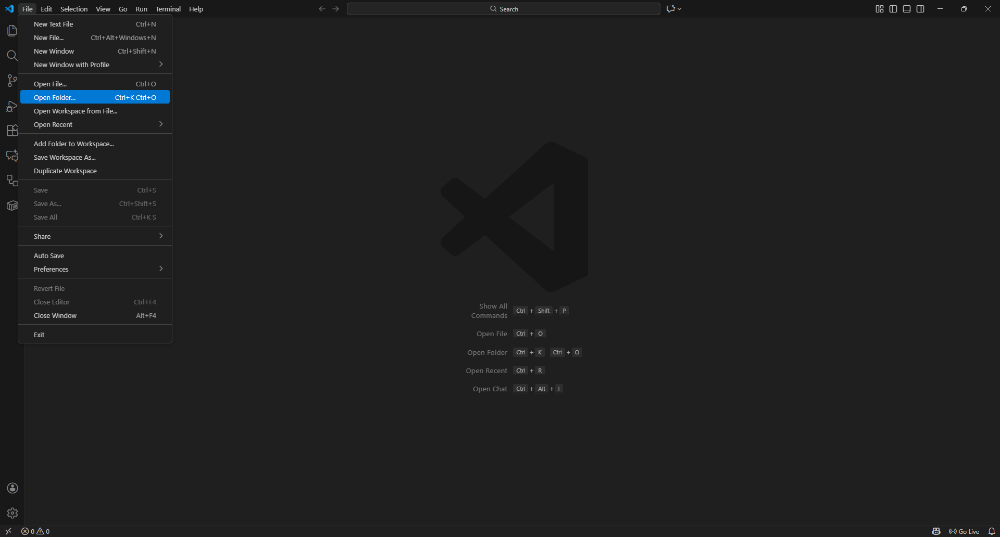
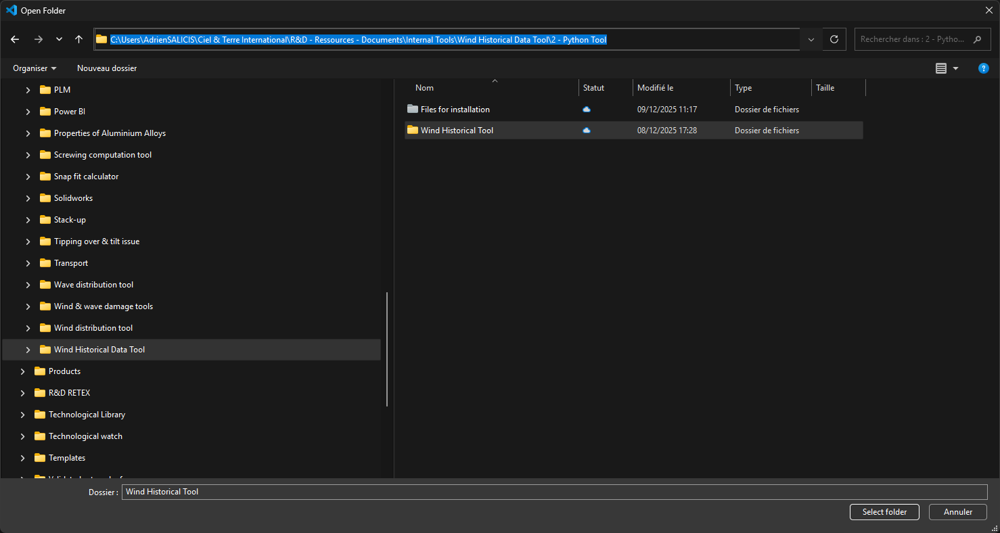
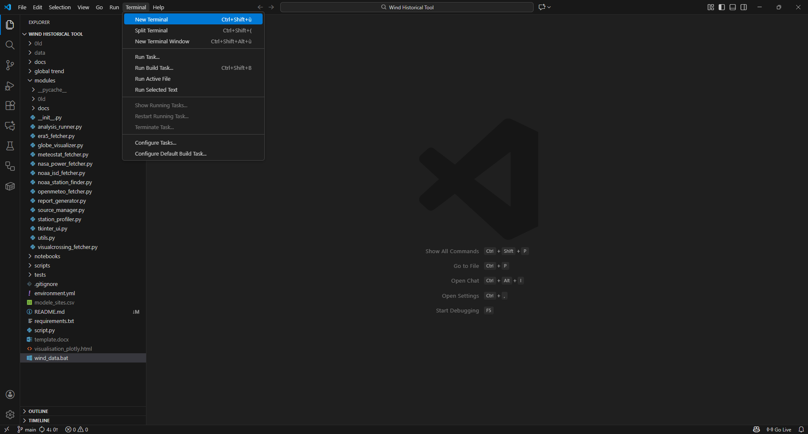
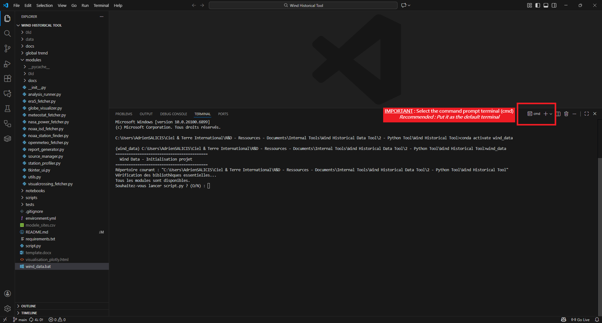

# Wind Data – Internal Wind Data Tool  
Ciel & Terre International – R&D

Wind Data is an internal Python tool developed to retrieve, normalize, and analyze historical wind data from multiple meteorological sources (observed and modeled).  
It is designed for engineering teams performing wind assessments, building code validations, model benchmarking, and automated reporting.

This repository corresponds to **Wind Data v1 (branch `v1-audit`)**, the stable reference implementation used in production.

---

# Overview

Wind Data automates the full workflow for wind analysis:

1. Site selection  
2. Multi-source data acquisition  
3. Standardization and normalization  
4. Descriptive and extreme-value statistics  
5. Cross-source comparisons (optional / WIP)  
6. Automated report generation  

---

## Documentation Index

The complete project documentation is located in the `docs/` directory.  
You can navigate to any document directly using the links below:

### Core Documentation

- [METHODOLOGY.md](./docs/METHODOLOGY.md)  
  Scientific framework, normalization rules, and statistical methods.
- [DATA.md](./docs/DATA.md)  
  Detailed description of all meteorological data sources.

### Development & Governance

- [CONTRIBUTING.md](./docs/CONTRIBUTING.md)  
  Rules for contributing, branching, commits, and PR workflow.
- [WORKFLOW.md](./docs/WORKFLOW.md)  
  Git usage guidelines and release flow.

### Project Planning

- [ROADMAP.md](./docs/ROADMAP.md)  
  Strategic plan for v1.x → v2.x evolution.
- [TODO.md](./docs/TODO.md)  
  Technical, scientific, and maintenance tasks grouped by priority.

### Legal

- [LICENSE](./docs/LICENSE)  
  MIT License.

---

# Key Features

- Multi-source historical wind retrieval (NOAA ISD, Meteostat, ERA5, NASA POWER, Open-Meteo)  
- Automatic preprocessing:
  - UTC timestamps
  - standard units (m/s)
  - 10 m reference height
  - daily aggregation
- **Standardized daily maxima** for mechanical design:
  - `windspeed_mean` = daily maximum of mean wind at 10 m  
  - `windspeed_gust` = daily maximum of gust at 10 m (or fallback via gust factor)
- Data quality assessment (coverage, gaps, station distance, etc.)  
- Extreme values (Gumbel) and configurable return periods (50 y, 100 y, 200 y, …)  
- Automated Word report generation (per site)  
- Interactive global visualization of sites and stations (Plotly, optional Mapbox satellite basemap)  

---

# Standardized Data Model (v1-audit)

All sources are normalized to a common daily data model before analysis.

For each source / station, the main CSVs exposed to the statistics engine (`modules/analysis_runner.py`) contain at least:

- `time` (datetime, UTC, daily)
- `windspeed_mean` (m/s)  
  Daily **maximum** of mean wind speed at 10 m.
- `windspeed_daily_avg` (m/s)  
  Daily average of mean wind speed at 10 m (informative).
- `windspeed_gust` (m/s)  
  Daily **maximum** of gust at 10 m.  
  If the source does not provide gusts, an optional **gust factor** can be applied to `windspeed_mean` to build a fallback.
- `wind_direction` (degrees, 0–360)  
  Daily mean wind direction computed as a **vector average**.
- `n_hours`  
  Number of hourly observations contributing to the daily aggregate.
- `source`  
  Source identifier (`noaa_station1`, `meteostat2`, `openmeteo`, `nasa_power`, `era5`, …).
- Station metadata (when applicable):
  - `station_id`, `station_name`
  - `station_latitude`, `station_longitude`
  - `station_distance_km`, `station_elevation`
  - `timezone`

All internal statistics (histograms, extremes, Gumbel, roses, etc.) are computed on these **daily maxima**.

---

# System Architecture

High-level pipeline diagram:

```
               +---------------------+
               |   modele_sites.csv  |
               +----------+----------+
                          |
                          v
                    +-----+-----+
                    | script.py |
                    | (main UI) |
                    +-----+-----+
                          |
                          v
             +------------+-------------+
             |        Source Manager    |
             +------------+-------------+
                          |
      -----------------------------------------------------
      |            |             |            |           |
      v            v             v            v           v
+-----------+ +-----------+ +-----------+ +-----------+ +-----------+
| NOAA ISD  | | Meteostat | |   ERA5    | | NASA POW. | | OpenMeteo |
| observed  | | observed  | |  model    | |  model    | |   model   |
+-----+-----+ +-----+-----+ +-----+-----+ +-----+-----+ +-----+-----+
      \            |             |            |            /
       \           |             |            |           /
        \          |             |            |          /
         +---------+-------------+------------+---------+
                          |
                          v
              +-----------+-------------+
              | Normalization Pipeline |
              | - timestamps (UTC)     |
              | - units (m/s)          |
              | - height correction    |
              | - daily maxima (10 m)  |
              +-----------+-------------+
                          |
                          v
                 +--------+--------+
                 | Stats Engine    |
                 | (analysis_runner)|
                 +--------+--------+
                          |
                          v
        +-----------------+------------------+
        |   Gumbel Return Levels Module      |
        |   - configurable return periods    |
        +-----------------+------------------+
                          |
                          v
              +-----------+-----------+
              | Report Generator      |
              | (Word, figures)       |
              +-----------+-----------+
                          |
                          v
      data/<SITE>/report/fiche_<SITE>.docx
```

---

# Repository Structure

Simplified project layout:

```
Wind-Data/
│
├── README.md
├── environment.yml
├── requirements.txt
├── wind_data.bat
├── script.py
├── modele_sites.csv       # to be filled by user
│
├── docs/
│   ├── INDEX.md
│   ├── CONTRIBUTING.md
│   ├── WORKFLOW.md
│   ├── METHODOLOGY.md
│   ├── DATA.md
│   ├── ROADMAP.md
│   ├── TODO.md
│   ├── SECURITY.md
│   └── LICENSE
│
├── modules/
│   ├── analysis_runner.py        # statistics, extremes, plots
│   ├── era5_fetcher.py           # ERA5 hourly + daily aggregation
│   ├── meteostat_fetcher.py      # Meteostat hourly → daily maxima
│   ├── nasa_power_fetcher.py     # NASA POWER daily
│   ├── openmeteo_fetcher.py      # Open-Meteo hourly → daily maxima
│   ├── noaa_isd_fetcher.py       # NOAA ISD hourly → daily maxima
│   ├── noaa_station_finder.py    # nearest NOAA stations search
│   ├── source_manager.py         # orchestrates all fetchers
│   ├── station_profiler.py       # stations context per site
│   ├── report_generator.py       # Word report per site
│   ├── globe_visualizer.py       # Plotly / Mapbox global map
│   ├── utils.py
│   └── 0ld/                      # legacy/unused modules (v1 history)
│
├── scripts/
│   ├── clean.py
│   ├── clean_output.py
│   └── site_enricher.py
│
└── data/
    (generated automatically, ignored by Git)
```

---

# Data Sources

Wind Data integrates multiple meteorological datasets:

| Source        | Type       | Native res. | Used res. in v1-audit | Strengths                 | Limitations / Notes                        |
|---------------|------------|-------------|------------------------|--------------------------|-------------------------------------------|
| NOAA ISD      | Observed   | Hourly      | Daily maxima           | High credibility         | Gaps, metadata inconsistencies            |
| Meteostat     | Observed   | Hourly      | Daily maxima           | Station network          | Inherits gaps from underlying datasets    |
| ERA5          | Model      | Hourly      | Daily maxima (10 m)    | No gaps, global          | Can underestimate extremes                |
| NASA POWER    | Model      | Daily       | Daily values (10 m)    | Smooth climatology       | Not designed for gust extremes alone      |
| Open-Meteo    | Model      | Hourly      | Daily maxima           | Easy API                 | Model-dependent gust parametrization      |

See full technical specification in [DATA.md](./docs/DATA.md).

---

# Installation

This project is hosted internally (SharePoint) and on GitHub.  
Recommended : Synchronize the folder on your computer, install the following softwares and dependencies.  
Open the synced folder with Visual Studio Code.  
Then you will be in a good environment to run the tool or work on it.  

Internal SharePoint starting point (to be synced):  
[Sharepoint path](https://cielterre.sharepoint.com/:f:/s/RD-Ressources/EsJXg3QcLeVBi4HyLlOAcQcBdlN-OUI6me08iRINvX17Dg?e=HzSON8)  

GitHub repository:  
<https://github.com/Ciel-et-Terre-International/rd-wind-data>

### Requirements

- **Conda (Anaconda or Miniconda)**  
  Download and install: <https://www.anaconda.com/download>  
  During installation, allow Conda to be added to `PATH`.

- **Visual Studio Code**  
  <https://code.visualstudio.com/>  
  Set the **Command Prompt** as default terminal and open the project folder.

- **ERA5 credentials (`.cdsapirc`)**  
  Download from SharePoint and place it in:  
  `C:\Users\%USERNAME%\.cdsapirc`

[Optional]  
Clone the GitHub repository:

```bash
git clone https://github.com/Ciel-et-Terre-International/rd-wind-data.git
cd rd-wind-data
```

### Create the Conda environment

```bash
conda env create -f environment.yml
```

Then:

```bash
conda activate wind_data
```

---

# Usage


Instructions for use  






From VS Code (Command Prompt terminal) or a regular CMD:

```bash
conda activate wind_data
wind_data.bat
```

Follow the prompts:

1. Confirm you want to run `script.py`.  
2. Enter **start** and **end** dates for the study period.  
3. The tool will:
   - fetch data for each site in `modele_sites.csv`,
   - normalize and analyze all sources (daily maxima),
   - generate the Word report and visualisation HTML.

Direct execution (not recommended):

```bash
conda activate wind_data
python script.py
```

---

# Outputs

For each site (e.g. `WUS242_FORT BRAGG`), the tool generates:

```text
data/<SITE>/
    <source>_<SITE>.csv               # per-source daily data
    era5_daily_<SITE>.csv             # ERA5 daily maxima
    figures_and_tables/
        stats_windspeed_mean.csv
        resume_qualite.csv
        histograms, boxplots, outliers
        time_series_windspeed_*.png
        rose_max_windspeed_*.png
        rose_frequency_*.png
        vent_moyen_extremes_*.csv
        rafales_extremes_*.csv
        return_periods_gumbel.csv
        return_period_50y.csv
    report/
        fiche_<SITE>.docx
```

At project root:

```text
visualisation_plotly.html   # interactive global map of sites and stations
```

- If the environment variable `MAPBOX_TOKEN` is set, the map uses a **satellite** basemap (Mapbox).  
`MAPBOX_TOKEN : pk.eyJ1IjoiYXNhbGljaXMiLCJhIjoiY21pd3lyZW95MDE1NzNmcXV3MW9xZTVyMCJ9.ycIrvPH-dCKyWBztK653Fg`
- Otherwise, a built-in **Natural Earth** basemap is used (no external token required).


---

# Contact

Project lead: Adrien Salicis  
Email: adrien.salicis@cieletterre.net


